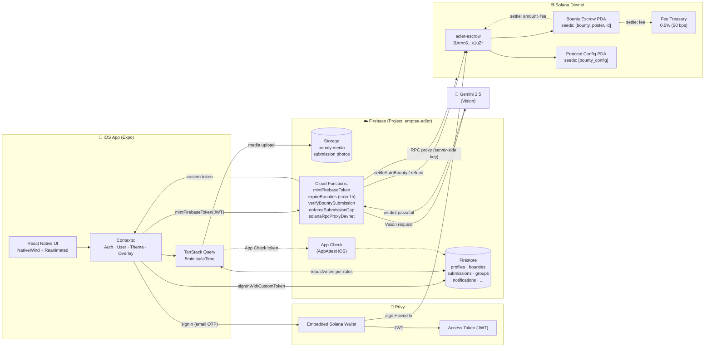
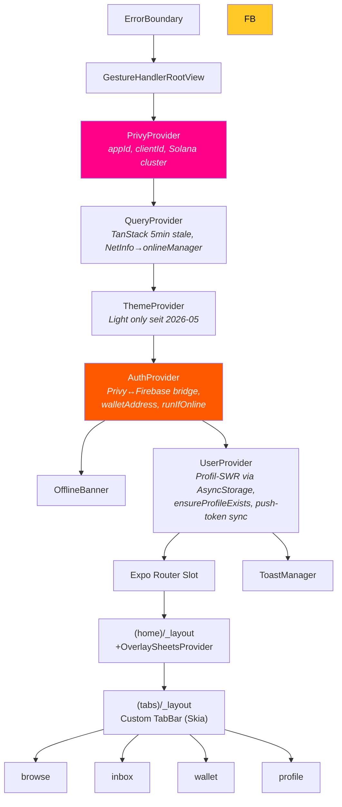
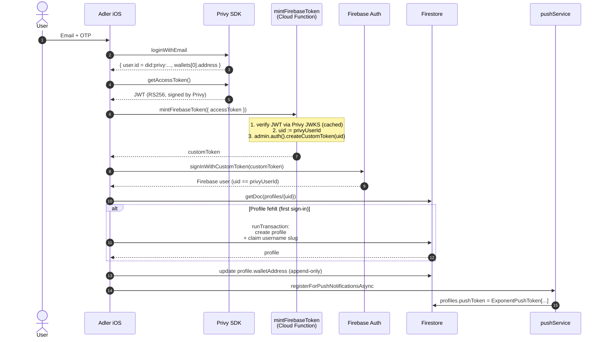
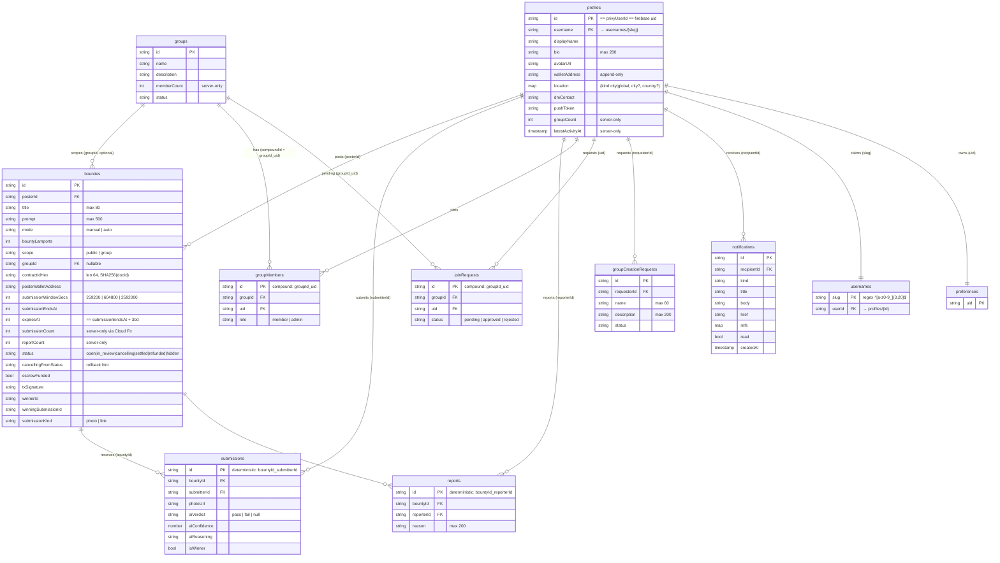
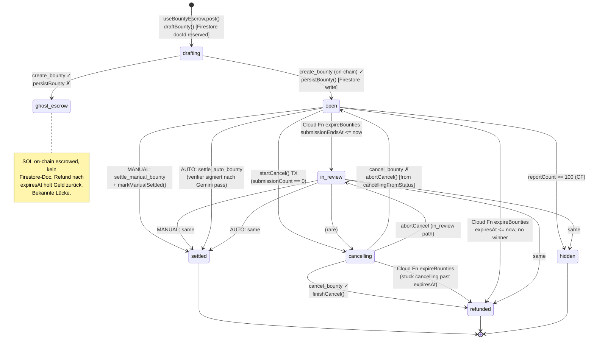
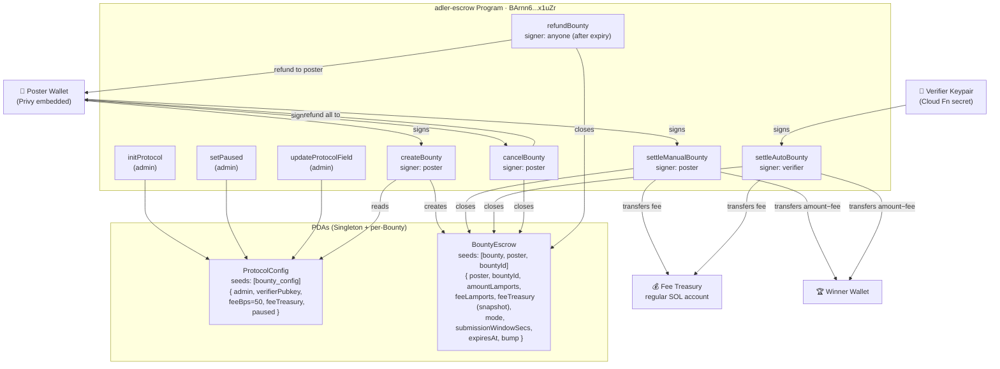

# Adler — Architektur-Review

> Stand: 2026-05-11 · Scope: mobile client + Firestore + Cloud Functions + `adler-escrow` (Solana devnet).
> Diagramme als Mermaid — rendert direkt in VS Code (mit Mermaid-Extension), GitHub, Obsidian.

---

## 1 · Gesamturteil

| Bereich | Note | Kommentar |
|---|---|---|
| **App-Architektur** | ⭐⭐⭐⭐ | Provider-Tree sauber, Two-State-Routing klar, Splitting Auth/User/Theme richtig getrennt. Drei kleine Mängel: redundante Routing-Guards, fragile `walletAddress`-Race in `UserContext`, kein pro-aktiver Token-Refresh. |
| **Firebase / Firestore** | ⭐⭐⭐⭐ | Rules sind granular, deterministische IDs gegen Duplikate, Cancel-State-Machine atomar via TX. Schwachpunkt: `contractIdHex` wird nur auf Länge geprüft, nicht auf Hex-Pattern; Gemini-Timeouts können Submissions ohne Verdict liegen lassen. |
| **Solana / Anchor** | ⭐⭐⭐⭐ | Determinist. PDAs, Drei-Phasen-Cancel mit Rollback, Privy-Signing korrekt isoliert. Bekannte Lücke: wenn `persistBounty` nach geglücktem `create_bounty` fehlschlägt, ist SOL on-chain aber kein Firestore-Doc da („ghost escrow"); aktuelle Mitigation = Refund nach `expiresAt`. |
| **Backend-Coupling** | ⭐⭐⭐ | Cloud Functions sind das wahre Backbone (mintFirebaseToken, expireBounties, verifyBountySubmission, enforceSubmissionCap). Sie reconciliieren on-chain ↔ Firestore — Single Point of Failure, aber notwendig. |

**Top-3-Risiken (sortiert):**
1. **Ghost-Escrow** wenn `persistBounty` nach `create_bounty` fehlschlägt → Refund nach 30d holt zwar SOL zurück, aber UX unklar. → mittel/hoch.
2. **Submission ohne Verdict** wenn Gemini timeout/error wirft → `aiVerdict: null` kann hängen bleiben. → mittel.
3. **`contractIdHex`-Validation** in Firestore-Rules prüft nur Länge, kein Pattern — könnte Unicode-Tricks erlauben. → niedrig (Server-side cross-checked).

---

## 2 · System-Landkarte

---

## 3 · Provider-Tree

Wenn man die App startet, hängen die Provider so ineinander:

> **Auffälligkeit:** `UserProvider` nutzt `useAuth()` — funktioniert dank Provider-Order, aber eng gekoppelt. Wenn `AuthProvider` jemals fehlschlägt, hat User keinen Recovery-Pfad. Mitigation: Top-level `ErrorBoundary` fängt das.

---

## 4 · Auth-Flow (Privy → Firebase)

**Wahrheits-Mapping:**
- `userId` ist **immer** `privyUserId` == `firebase.auth.currentUser.uid`. Keine getrennten ID-Räume.
- `walletAddress` ist „append-only" (firestore.rules:41–42) — kann nie überschrieben werden, nur erstmalig gesetzt.
- Custom-Token-Lebenszeit < 1h. Re-bridge passiert **nur**, wenn `privyUserId` sich ändert (AuthContext:67–114) → **bei langer Session läuft Firebase-Token ggf. ab**, ohne pro-aktiven Refresh.

---

## 5 · Firestore ERD

**Key-Design-Patterns:**
- **Deterministische Compound-IDs** (`submissions`, `reports`, `groupMembers`, `joinRequests`) = harte Anti-Duplikat-Garantie auf Datenbankebene. Kollidierender create wird von Rules abgelehnt — keine race-prone „checkThenWrite"-Logik nötig.
- **Server-only-Felder** (`submissionCount`, `reportCount`, `groupCount`, `status`-Transitions) werden über Cloud Functions verwaltet und in Rules eingefroren (`request.resource.data.x == resource.data.x`).
- **Username-Claim** in Transaktion (`profileService.createProfile`) → atomare Reservierung über `profiles` + `usernames` Collections.

---

## 6 · Bounty-Lifecycle (State-Machine)

**Quelle-der-Wahrheit-Matrix:**

| Übergang | On-Chain | Firestore | Notizen |
|---|---|---|---|
| Create | escrowiert SOL | metadata, status=open | Beides erforderlich — Ghost-Risiko (s.o.) |
| Submit | — | submission doc | Anti-Dupe via determ. ID |
| Manual-Settle | poster signiert, fee abgezogen | winnerId, txSig, status=settled | Poster entscheidet off-chain |
| Auto-Settle | verifier signiert | aiVerdict=pass, status=settled | Cloud Fn orchestriert |
| Cancel | poster signiert | 3-Phase TX | atomar gegen race-submit |
| Refund | anyone signs (after expiry) | status=refunded (via CF) | Permissionless safety-net |
| Hidden | n/a | status=hidden | report ≥ 100, CF only |

---

## 7 · Solana-Programm-Architektur

**Sicherheits-Gates (on-chain):**

| Instruktion | Validierung |
|---|---|
| `createBounty` | seed-derived PDA, `amount > 0`, `bountyId` unique (PDA-creation fails wenn schon existent) |
| `settleManualBounty` | `has_one = poster`, `fee_treasury == config.fee_treasury` (siehe IDL `feeTreasuryMismatch`), nicht abgelaufen |
| `settleAutoBounty` | `verifier_pubkey == config.verifier_pubkey`, sonst `posterMismatch`/`verifierMismatch` |
| `refundBounty` | `now > escrow.expires_at`, `has_one = poster` (Geld geht an Poster, nicht an Caller) |
| `cancelBounty` | `has_one = poster`, kein Expiry-Check on-chain (off-chain via Firestore TX `submissionCount == 0`) |

**Wichtig:** `feeTreasury` wird **bei Create gesnapshottet** in den Escrow-Account. Wenn Admin später `config.feeTreasury` ändert, zahlen alte Bounties an die alte Adresse — gewollt, vermeidet rug-Vektor.

---

## 8 · Findings — App-Architektur

| # | Severity | Lokation | Befund | Empfehlung |
|---|---|---|---|---|
| A1 | 🟡 medium | `contexts/AuthContext.tsx` re-bridge nur on `privyUserId` Change | Firebase Custom-Token läuft nach <1h ab. Lange Sessions können stale werden — Firestore-Writes schlagen plötzlich fehl. | `onIdTokenChanged` Listener + pro-aktiver `getIdToken(true)` Refresh; oder Re-bridge bei 401-Errors via fetch-retry interceptor. |
| A2 | 🟡 medium | `contexts/UserContext.tsx` `walletAddress` als effect-dependency | Wenn Privy embedded wallet verzögert hydratisiert (sehe oft 200-500ms gap nach Login), feuert `fetchProfile()` 2× — einmal ohne, einmal mit Wallet. Verschwendet RTT, kein Datencrash dank `isMounted`. | Effect erst feuern, wenn `walletAddress` stabil ist (warten oder default null). Oder: Wallet aus Effect rausnehmen und nur in `ensureProfileExists` reichen. |
| A3 | 🟢 low | `app/index.tsx`, `(home)/_layout.tsx`, `(auth)/_layout.tsx` | Drei redundante `isReady`/`isBridging`/`loading` Guard-Blocks. DRY-Verletzung, aber defensive. | Konsolidieren in einen `<RequireAuth>` Wrapper-Component. |
| A4 | 🟢 low | `components/ui/TabBar.tsx` virtual „create" slot | Kein Tabs.Screen, nur als Kommentar dokumentiert (Zeile 29–30). | JSDoc-Block oder explizites `tabBarButton`-Pattern mit `href: null` macht es entdeckbar. |
| A5 | 🟢 low | Provider-Tree | `UserProvider` hängt von `AuthContext` ab, beide haben keine eigene `ErrorBoundary`. | Sub-Boundary um `UserProvider` für graceful fallback (Profile-Fetch hängt → Sign-Out CTA). |

---

## 9 · Findings — Firebase

| # | Severity | Lokation | Befund | Empfehlung |
|---|---|---|---|---|
| F1 | 🟡 medium | `functions/index.js:397` (`verifyBountySubmission`) | Gemini-Vision-Call ohne Retry / Timeout-Guard. Submission bleibt mit `aiVerdict: null` hängen, falls Gemini hängt. | exponential-backoff retry (2-3 attempts), nach final fail: `aiVerdict: 'fail'` + Reasoning „verifier unavailable", damit der Auto-Mode nicht stuck bleibt. Oder dead-letter via separate Collection. |
| F2 | 🟡 medium | `functions/index.js:485` (`verifyBountySubmission`, on-chain settle fail path) | Bei on-chain Settle-Error wird `aiReasoning` mit Error-Text überschrieben — könnte echtes Vision-Reasoning verlieren. | Separates Feld `settleError` einführen statt `aiReasoning` zu mutieren. |
| F3 | 🟢 low | `firestore.rules:69` (`bountyValidShape`) | `contractIdHex.size() == 64` prüft Länge, aber nicht Hex-Pattern. Unicode-Glyphen die 1 Char belegen aber bytemäßig anders sind, könnten durchrutschen. | `request.resource.data.contractIdHex.matches('^[0-9a-f]{64}$')` ergänzen. |
| F4 | 🟢 low | `functions/index.js:572` (`expireBounties` cron) | Limit 50 pro Run (Zeile 620) bei 1h-Frequenz. Bei Burst-Last (>50 Bounties expire pro Stunde) baut sich Backlog auf. | `MaxInstances` + dynamische Batch-Größe (limit 500) oder Cron auf 15 min reduzieren. |
| F5 | 🟢 low | `firestore.rules` `notifications` update path | User kann `read`-Flag flippen, alle anderen Felder müssen `==` bleiben. Korrekt — aber kein Test gegen multiple gleichzeitige `markAllRead`-Calls (race in `notificationsService:73`). | Cloud-Fn-Endpoint `markAllRead({ uid })` der einen batched-write macht. Niedrige Priorität — idempotent. |
| F6 | 🟢 low | `lib/services/submissionService.ts` | Deterministische ID `${bountyId}_${uid}` verhindert duplicate create, aber Client kennt diese Tatsache nicht → Retry zeigt nur generic Firestore-Permission-Error. | Vor Submit `getDoc(submissions/{deterministicId})` checken; UX-Message „Du hast schon eingereicht." statt Permission-Denied. |
| F7 | 🟢 low | `functions/index.js:162` (`loadVerifierKeypair`) | Kein Längen-Check auf bs58-decoded secret. Korruptes Secret crash → Function-Exception. | `if (decoded.length !== 64) throw new Error(...)` mit klarer Meldung. |

---

## 10 · Findings — Solana / Escrow

| # | Severity | Lokation | Befund | Empfehlung |
|---|---|---|---|---|
| S1 | 🔴 hoch | `hooks/useBountyEscrow.ts:90–112` (`post` flow) | Wenn `escrowCreateBounty` ✓ aber `persistBounty` ✗ (Netzwerk-Drop, App-Crash) → Geld ist on-chain im PDA, **kein** Firestore-Doc. User sieht keine Bounty, kennt aber den `contractIdHex` nicht mehr → kann nur via Refund nach 30d zurückgeholt werden. | Reihenfolge umdrehen: Firestore-Doc in `escrowFunded: false` zuerst schreiben, dann on-chain create, dann update auf `escrowFunded: true`. So weiß man immer welches Doc zu welchem Escrow gehört. Cloud Fn könnte `escrowFunded: false`-Docs nach 5min sweepen + sicherstellen, on-chain existiert keine PDA. |
| S2 | 🟡 medium | `hooks/useBountyEscrow.ts:174–183` (`cancel` error path) | Wenn `escrowCancel` fehlschlägt, läuft `abortCancel()` fire-and-forget mit `.catch(warn)`. Falls `abortCancel` selbst auch fehlschlägt, ist Bounty stuck in `cancelling` bis Cron-Sweep. | Status anzeigen („Cancel pending — wird in ~1h reconciliert") + Toast statt silent warn. |
| S3 | 🟡 medium | `lib/escrow/settleManualBounty.ts:17` | `fetchFeeTreasury()` liest live aus `ProtocolConfig`, übergibt es als Account. On-chain validiert dann gegen `escrow.feeTreasury` (snapshot bei Create). Wenn Admin Treasury zwischendurch wechselt, schlägt jeder settle alter Bounties mit `feeTreasuryMismatch` fehl. | Live-Fetch entfernen — stattdessen `escrow.feeTreasury` aus der PDA lesen und das als Account übergeben. Reduziert Failure-Modus. |
| S4 | 🟡 medium | `lib/anchor/program.ts` Dummy-Wallet | AnchorProvider wird mit Dummy-Wallet konstruiert (signTransaction throws). Read-only OK, aber jeder andere Code-Pfad der versehentlich `program.methods.x().rpc()` aufruft (statt unsere ix-builder + Privy) → opaker Crash. | ESLint-Regel oder Wrapper-Type, der `.rpc()`-Aufruf auf Program-Objekten verbietet. Oder Custom-AnchorProvider mit klarem `unsupportedSign()` Error. |
| S5 | 🟢 low | `firestore.rules:69` `contractIdHex.size() == 64` ↔ Solana `bountyId: [u8;32]` | 32 bytes hex = 64 chars, passt. Aber: keine Validierung dass Hash deterministisch aus `docId` abgeleitet wurde. Theoretisch könnte Poster falschen `contractIdHex` ins Firestore schreiben (mit korrektem on-chain createBounty mit anderem id). | Cloud Fn-Trigger auf `bounty.create` der `contractIdHex == sha256(docId)` cross-checkt; bei Mismatch Doc löschen. |
| S6 | 🟢 low | `lib/escrow/refundBounty.ts` | `refundBounty` ist permissionless (jeder kann signieren + zahlt nur tx-fee). Gut für Cloud-Fn-Sweep, aber MEV-Bots könnten Sweep frontrunnen — kein Schaden, nur unnötige tx-fees für den Bot. | Keine Aktion nötig. Erwähnt zur Vollständigkeit. |

---

## 11 · Empfohlene Quick-Wins (Sprint-Pass-Order)

Reihenfolge nach Aufwand × Impact für die Hackathon-Submission:

1. **S1** (Ghost-Escrow): Reihenfolge in `useBountyEscrow.post()` flippen — 30min Arbeit, eliminiert das hässlichste Edge-Case.
2. **F6** (Duplicate-Submit UX): Pre-check + friendly toast — 20min, sichtbar im Demo.
3. **F1** (Gemini-Retry + Dead-Letter): 1h Arbeit, macht Auto-Mode demo-stabil.
4. **A1** (Token-Refresh): `onIdTokenChanged` Listener, 45min — verhindert „funktioniert in den ersten 5min, dann tot"-Bug bei Jury-Demo.
5. **F3** (Hex-Pattern in Rules): 1-Zeilen-Change. Free win.
6. **S3** (Live-Fetch entfernen): 15min, härtet Settle gegen Admin-Treasury-Switch.

> S2, S4, F2, F4, F5, F7, A2–A5 sind post-Hackathon-Polish.

---

## 12 · Open Questions

- Wird `expireBounties` aktuell auf Devnet wirklich gecronnt? Falls nicht: refund-Sweep läuft nie, alle „expired" Bounties bleiben auf `open` stehen bis manueller Trigger.
- Gibt es einen Health-Check auf `solanaRpcProxyDevnet`? Bei RPC-Outage fällt der Auto-Mode komplett aus, ohne UI-Signal.
- Mainnet-Programm-ID == Devnet-Programm-ID (siehe `escrow.ts:7–9`) — ist das intentional bis Audit + Squads-Multisig steht? Wenn ja, klar in Docs vermerken.
